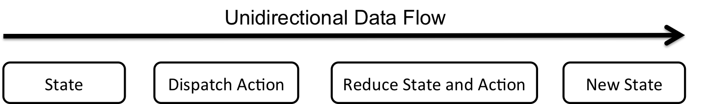

LIME - Documentation

[[TOC]]

# Redux Documentation

The goal behind Redux is to make state mutation more predictable. There are a few design decisions that Redux enforces to fulfill this goal. First, the state of the whole application lives within a single object tree called the store. Secondly, the store is read only, it can only change by dispatching actions. Whenever an action is dispatched, an entirely new read-only state is created. As such the state continues to be immutable. Finally, all changes to the state happen through pure functions. Pure functions are deterministic functions that neither mutate the state nor have any side effect. In Redux, these functions are called reducers. The reducers take the current state and an action and produce a new state instance.

As such, Redux forces the data-flow to be unidirectional. The application state only changes when the store dispatches an action. This can be done by calling, store.dispatch(action). An action is plain JSON describing the change that is going to happen to the state. Whenever an action is dispatched, the store calls the root reducer and passes it the state and action. The reducer would then handle the action and produce a new state. 

Suppose that the store looks as follows:

const state = {

count: 0

}

And that we have the following action:

const action = {

	type: INCREMENT,

	payload: 2

}

And suppose the reducer would increment the count by the payload if the action type is *INCREMENT*. If the state is an Immutable.js Map, the reducer may look as follows:

function reducer(state, action): {

	switch(action.type) {

		case INCREMENT:

			state = state.update(count, count => count+action.payload);

			return state

		case default:

			return state

}

} 

Then calling store.dispatch(action) and reading the state perhaps with store.getState() would give us: 

const state = {

count: 2

}

The example above illustrates how the Redux data flow works. Developers using Redux would have to do three things:

1. Design the application store; that is decide on what state your app should keep track of and how it should be structured.

2. Design and implement the actions required for changing the application state. Think about how the user may change the application state and write these changes as pure functions returning actions (objects with a type and payload attributes).

3. Design and implement the application reducer. The application reducer combines the state and actions. It describes how the state should change when an action is dispatched.

Now we delve into describing how we have design LIME’s store, actions and reducers.

## The Store

The store is a JavaScript object that describes the entire application state. It additionally has three methods. A getState() method which allows for read-only access to the application state. A dispatch(action) method which allows for updating the state by dispatching an action. And a subscribe(listener) method which handles registering listeners and returns a function for unregistering these listeners. 

Our first task in using Redux with React is to think about and design the application state. In a React app there are two types of state to keep track of, the application’s data, what information should be rendered, and the application’s UI state, what views and which information should be shown. In the first version of LIME, we had three forms of data: announcements, courses and scholars. Thus we designed the root state as follows: 

const state = {

announcements: {},

announcementsUI: {},

courses: {},

coursesUI: {},

community : {},

communityUI: {}

}

In Redux the state of the entire application is stored in the store and that state is the single source of truth. Thus, the division that we’ve done above helps us think about the announcements’ state, the courses’ state and community’s state separately; although they live in the same tree. 

Now let’s look at the design our application data, starting with the announcements subtree. Let’s look at a single announcement and how it is stored in the database. Every announcement has an id associated with it. It has a header (announcement title), a message, a timestamp of when it was posted and a user_id pointing to the user that made the announcement. A sample announcement may look as follows: 

const sample_announcement = {

id: 1,

header: ‘Welcome to LIME’,

body_params: {

	message: ‘Thank you for joining the LIME community’,

	timestamp: ‘Fri, 10 Mar 2017 20:07:11’,

	user: 1

}

}

Notice how the body_params attribute in this sample announcement. We structured the announcement object as follows while keeping in mind our React components. Some of the React components only care about an announcement’s content and not its id or title. This is the case when rendering the item panel (see React components). Thus we structure the state in a way that is accessible by our React components.

A similar structure is followed for courses and scholars, but with different data. For example, this is what a sample course and a sample scholar may look like.

const sample_course = {

id: 1,

body_params: {

	title: ‘Intro to JavaScript’,

	source: ‘Flatiron School’,

	link: ‘[https://flatironschool.com/programs/online-intro-javascript-free-course/](https://flatironschool.com/programs/online-intro-javascript-free-course/)’

	img: ‘[https://flatironschool.imgix.net/js.jpg?fit=crop&crop=entropy](https://flatironschool.imgix.net/js.jpg?fit=crop&crop=entropy)’

	list: [1, 2],

	description: ‘Learn to code in JavaScript’

}

}

const sample_scholar = {

id: 1,

body_params: {

	title: ‘Noor Eddin Amer’,

	source: ‘MIT Media Lab’,

	link: ‘[https://nooralasa.github.io/](https://nooralasa.github.io/)’

	img: ‘/styles/img/community/noor.jpg’

	list: [1],

	description: ‘Noor is a graduate student at the MIT Media Lab’

}

}

You may notice that the object attributes for courses and scholars are the same. Again, this is due to the interaction with React Components. Both courses and scholars are rendered by the same React Components and their content is accessed through the same attribute names. The list in the attributes above indicates which classes the scholar is enrolled in and vice versa. 

Now that we know what a sample announcement looks like we can design the overall announcements subtree. The announcements subtree will have the following attributes: 

const announcements = {

	announcementsList: [1],

	announcementsById: {

		1: sample_announcement

	}

networkStatus: {

	isRequesting: false,

	requests: [‘add_announcement’],

	responses: [‘Added Announcement 1’]

}

}

The announcementsList includes a list of all announcement ids. While announcementsById is an object pointing each announcement id to its corresponding announcement object as described earlier. The decoupling of the ids and objects allows for easy manipulation of the two in the React Components. 

The only object that is left to discuss is networkStatus. networkStatus was added to account for the asynchronous state of our application. In fact, announcementsList and announcementsById are going to be filled by asynchronous communication with the database through a CRUD API. We use networkStatus to keep track of the state of that communication. isRequesting is a boolean that is set to true whenever we are waiting for an asynchronous call to return. requests is a list of the network requests that we’ve issued over the life cycle of the application and responses is a list of the API calls response. These two lists act as a log of the network communication and can be referenced if errors show up.

The community and courses follow the very same structure. The only difference is that they map ids to courses and scholars instead of announcements. Additionally, the community object keeps track of the id of the currentlyLoggedIn user. This is helpful for the React Components to know which user is performing the actions.

Now, let’s take a look at announcementsUI. announcementsUI is a simple object with two attributes: a boolean, isAnnouncementsListViewable, and an id currentlyVisibleAnnouncement. isAnnouncementsListViewable indicates whether we are rendering the panel list of all announcements or an item panel for a specific announcement. The currentlyVisibleAnnouncement indicates which announcement should be rendered if we are in the item panel. 

const announcementsUI = {

	isAnnouncementsListViewable: false,

	currentVisibleAnnouncement: 1

}

In a nutshell, these two attributes are used by the React Components to decide on the UI state, that is what view to render. The same structure is used for coursesUI and communityUI.

Bringing all of these subtrees together, gives us the state of our application. A snapshot of the current state can be accessed at any moment with store.getState(). A sample snapshot of our overall application state may look as follows:

const state = {

announcements: {

	announcementsList: [1],

	announcementsById: {

		1: {

id: 1,

header: ‘Welcome to LIME’,

body_params: {

	message: ‘Thank you for joining the LIME community’,

	timestamp: ‘Fri, 10 Mar 2017 20:07:11’,

	user: 1

}

}

	}

networkStatus: {

	isRequesting: false,

	requests: [‘add_announcement’],

	responses: [‘Added Announcement 1’]

}

},

announcementsUI: {

	isAnnouncementsListViewable: false,

		currentVisibleAnnouncement: 1

},

courses: {

	coursesList: [1],

	coursesById: {

		1: {

id: 1,

body_params: {

	title: ‘Intro to JavaScript’,

	source: ‘Flatiron School’,

	link: ‘[https://flatironschool.com/js](https://flatironschool.com/programs/online-intro-javascript-free-course/)’

	img: ‘/styles/img/js.jpg’

	list: [1],

	description: ‘Learn to code in JavaScript’

}

}

	}

networkStatus: {

	isRequesting: false,

	requests: [‘add_course’],

	responses: [‘Added Course 1’]

}

},

coursesUI: {

	isCoursesListViewable: false,

		currentVisibleCourse: 1

},

community : {

	communityList: [1],

	coursesById: {

		1: {

id: 1,

body_params: {

	title: ‘Noor Eddin Amer’,

	source: ‘MIT Media Lab’,

	link: ‘[https://nooralasa.github.io/](https://nooralasa.github.io/)’

	img: ‘/styles/img/community/noor.jpg’

	list: [1],

	description: ‘Noor is a graduate student at the Media Lab’

}

}

	}

networkStatus: {

	isRequesting: false,

	requests: [‘add_scholar’, ‘add_scholar_course’],

	responses: [‘Added Scholar 1’, ‘Added scholar 1 to course 1’]

}

},

communityUI: {

	isCommunityListViewable: false,

		currentVisibleScholar: 1

}

}

## Actions

Actions are payloads of data that send information from the application to the store. They are the only source of information to the store and they specify any changes in the state. Actions are dispatched by calling store.dispatch(action) and usually dispatching an action would update the state. 

Here is a sample action that can be used in LIME:

const ADD_ANNOUNCEMENT = 'ADD_ANNOUNCEMENT';

const action = {

	type: ADD_ANNOUNCEMENT,

	payload: sample_announcement

}

Actions in lime are expected to have a type and potentially a payload. The type is a string specifying the type of action that is dispatched. This is used by the reducer to figure out how to change the state. The payload is any data that is relevant to the action. In this example we included the announcement object that is to be added to the state. 

Action Creators are functions that return an action. For instance, an action creator that is used for adding an announcement can look something like this: 

function addAnnouncement(announcement) {

	return {

	type: ADD_ANNOUNCEMENT,

	payload: sample_announcement

}

}

You may be wondering why would you need to use action creators? Well there are a few reasons for that. First, you can pass arguments into the action creators. If you only use actions, you would have to create a new action with a different payload for every new announcement. With the action creator, however, you can use the same action creator and pass it different arguments, automating the process. Secondly, action creators are testable. You can write unit tests to ensure that they return the expected action.

There is a third and important reason: action creators can be asynchronous. Before returning the action, you can make an AJAX call, say to your database, and use the returned data in the action’s payload. In general, Redux restricts asynchronous calls. The whole motivation behind Redux is to make the application state more predictable. Asynchronous calls are unpredictable and they would make action creators nondeterministic. Therefore, Redux requires action creators to be pure functions. 

Pure functions are functions were the returned value is determined only by the input. Passing the same input into a pure function would always produce the same result. Additionally, they have no other side effects. Making AJAX calls within an action creator would make them impure. First, the AJAX call may have a multitude of possible responses. In LIME, we use AJAX calls to communicate with the database through a backend API. The API calls may return the expected result, but they may also return an error message, perhaps if the requested resource is not in the database or if it violates a certain database constraint. Moreover, there is a third possibility where things would go wrong in the network. The request could get lost, or the backend server may be down. In a nutshell, the output of the function will not be deterministic and the function could have side effects.

So how can we make AJAX calls when using Redux while continuing to keep the state predictable? AJAX calls are an expectation of modern web applications. They let you persist your app and make it more dynamic. The Redux workaround is to use middleware. Middleware are functions that are run between the framework receiving a request and generating a response. They can be used for a variety of things, and frameworks like Express rely on them on the server side to achieve results like authentication, logging and compression. 

Redux uses middleware to provide a third-party extension point between dispatching a action and sending it to the reducer. The Redux Thunk middleware can be used to allow for asynchronicity in action creators. The key idea is that action creators can return one of two things, an action or a function returning an action. If a function is returned, that function would return different actions depending on the state of the asynchronous call. 

This is best understood by going through an example. Let’s look at the action creator we showcased earlier for adding an announcement. In the original formulation of the addAnnouncement action creator, it was a pure function. Now imagine that we want to make an AJAX call in order to persist the announcement and add it to our database. If we do that, the action creator will not be pure anymore (it has a side effect of adding new entries to a database) and Redux would throw an error. Now suppose that we use the redux-thunk middleware, then we can make addAnnouncement return a function instead of an action. What should that function do? 

To decide how this function should behave, we must understand what states our application should be aware of when we make an API call. There are two crucial moments that our application should be aware of: the moment when the call is made and the moment when we receive a response (or a timeout). We create an action for each of these moments. 

const ADD_ANNOUNCEMENT_REQUEST = 'ADD_ANNOUNCEMENT_REQUEST'; 

const ADD_ANNOUNCEMENT_SUCCESS = 'ADD_ANNOUNCEMENT_SUCCESS';

const ADD_ANNOUNCEMENT_FAILURE = 'ADD_ANNOUNCEMENT_FAILURE';

The first action, ADD_ANNOUNCEMENT_REQUEST , indicates that we have issued an asynchronous call for adding an announcement. It is useful for our application to know that this request has been issued since it may affect the view of our application. In the networkStatus object in the announcements subtree of our state, the isRequesting flag would be set to true. We can use this information to change the UI, perhaps by showing a spinner while the user awaits a response. 

The next crucial moment in the AJAX call life cycle is the calls response. There are two possible responses: a successful response indicating that the announcement has been added to the database, or an error indicating a server side error or a timeout. We handle each case with a separate action ADD_ANNOUNCEMENT_SUCCESS and ADD_ANNOUNCEMENT_FAILURE.   

Let’s write an action creator for each of these actions. The 

function addAnnouncementRequest() {

	return {

	type: ADD_ANNOUNCEMENT_REQUEST

}

}

function addAnnouncementSuccess(announcement) {

	return {

	type: ADD_ANNOUNCEMENT_SUCCESS,

	payload: announcement

}

}

function addAnnouncementFailure(error) {

	return {

	type: ADD_ANNOUNCEMENT_FAILURE,

	payload: error

}

}

Now we are ready to write the function that our action creator addAnnouncement should return. The function should start by dispatching the ADD_ANNOUNCEMENT_REQUEST action. It should then make the AJAX call. If the call is successful, it dispatches the ADD_ANNOUNCEMENT_SUCCESS action. If the call fails, it dispatches the ADD_ANNOUNCEMENT_SUCCESS action. 

function addAnnouncement(announcement) {

	return dispatch => {

		dispatch(addAnnouncementRequest);

		

		return axios.post(‘/api/v1/announcements’, {

			header: announcement.header,

			message: announcement.message,

			user_id: announcement.user_id

		}).then( res => {

			dispatch(addAnnouncementSuccess(res.data));

		}).catch( err => {

			dispatch(addAnnouncementFailure(err));

		})

}

}

The code snippet above is written in ES6. Notice the arrow notation for defining functions. We also use the axios library for making the AJAX call, but the main idea is the same. Now whenever addAnnouncement is dispatched, the thunk-middleware would run this function before passing the results to the reducer. Since addAnnouncementRequest, addAnnouncementSuccess and addAnnouncementFailure are all pure functions, Redux would not complain. More importantly, the state of the application is fully predictable. Even if things would go wrong in the AJAX call, our application state would account for all the possibilities. 

Our application state is split into six subtrees: announcements, courses, community, announcementsUI, coursesUI and communityUI. In order to change each of these subtrees, we defined actions and action creators for each of these subtrees. All of these actions and action creators follow the same structure as discussed above. Below is a list of all these actions and action creators with specifications for understanding how the state can change.

<table>
  <tr>
    <td>Announcement Action Types</td>
    <td></td>
    <td></td>
    <td></td>
  </tr>
  <tr>
    <td>Action Type</td>
    <td></td>
    <td>Description</td>
    <td></td>
  </tr>
  <tr>
    <td>FETCH_ANNOUNCEMENTS_REQUEST</td>
    <td></td>
    <td>Indicates that an AJAX call for getting all announcements from the db has been issued</td>
    <td></td>
  </tr>
  <tr>
    <td>FETCH_ANNOUNCEMENTS_SUCCESS</td>
    <td></td>
    <td>Indicates that an AJAX call for getting all announcements from the db was successful</td>
    <td></td>
  </tr>
  <tr>
    <td>FETCH_ANNOUNCEMENTS_FAILURE</td>
    <td></td>
    <td>Indicates that an AJAX call for getting all announcements from the db failed</td>
    <td></td>
  </tr>
  <tr>
    <td>ADD_ANNOUNCEMENT_REQUEST</td>
    <td></td>
    <td>Indicates that an AJAX call for adding an announcement to the db has been issued</td>
    <td></td>
  </tr>
  <tr>
    <td>ADD_ANNOUNCEMENT_SUCCESS</td>
    <td></td>
    <td>Indicates that an AJAX call for adding an announcement to the db was successful</td>
    <td></td>
  </tr>
  <tr>
    <td>ADD_ANNOUNCEMENT_FAILURE</td>
    <td></td>
    <td>Indicates that an AJAX call for adding an announcement to the db failed</td>
    <td></td>
  </tr>
  <tr>
    <td>UPDATE_ANNOUNCEMENT_REQUEST</td>
    <td></td>
    <td>Indicates that an AJAX call for updating an announcement in the db has been issued</td>
    <td></td>
  </tr>
  <tr>
    <td>UPDATE_ANNOUNCEMENT_SUCCESS</td>
    <td></td>
    <td>Indicates that an AJAX call for updating an announcement in the db was successful</td>
    <td></td>
  </tr>
  <tr>
    <td>UPDATE_ANNOUNCEMENT_FAILURE</td>
    <td></td>
    <td>Indicates that an AJAX call for updating an announcement in the db failed</td>
    <td></td>
  </tr>
  <tr>
    <td>DELETE_ANNOUNCEMENT_REQUEST</td>
    <td></td>
    <td>Indicates that an AJAX call for deleting an announcement in the db has been issued</td>
    <td></td>
  </tr>
  <tr>
    <td>DELETE_ANNOUNCEMENT_SUCCESS</td>
    <td></td>
    <td>Indicates that an AJAX call for deleting an announcement in the db was successful</td>
    <td></td>
  </tr>
  <tr>
    <td>DELETE_ANNOUNCEMENT_FAILURE</td>
    <td></td>
    <td>Indicates that an AJAX call for deleting an announcement in the db failed</td>
    <td></td>
  </tr>
  <tr>
    <td>Announcement Action Creators (Async)</td>
    <td></td>
    <td></td>
    <td></td>
  </tr>
  <tr>
    <td>Action Creator</td>
    <td>Params</td>
    <td></td>
    <td>Returns</td>
  </tr>
  <tr>
    <td>fetchAnnouncements</td>
    <td></td>
    <td></td>
    <td>A function making an API call to get all announcements from the db</td>
  </tr>
  <tr>
    <td>addAnnouncement</td>
    <td>header: the ann. title,
message: the ann. body,
user_id: the announcer’s id</td>
    <td></td>
    <td>A function making an API call to add an announcement to the db</td>
  </tr>
  <tr>
    <td>updateAnnouncement</td>
    <td>id: the ann. id,
header: the ann. title,
message: the ann. body,
user_id: the announcer’s id</td>
    <td></td>
    <td>A function making an API call to updated the specified announcement in the db</td>
  </tr>
  <tr>
    <td>deleteAnnouncement</td>
    <td>id: the ann. id</td>
    <td></td>
    <td>A function making an API call to delete the specified announcement in the db</td>
  </tr>
  <tr>
    <td>Announcement Action Creators (Pure)</td>
    <td></td>
    <td></td>
    <td></td>
  </tr>
  <tr>
    <td>Action Creator</td>
    <td>Params</td>
    <td></td>
    <td>Returns</td>
  </tr>
  <tr>
    <td>fetchAnnouncementsRequest</td>
    <td></td>
    <td></td>
    <td>{
  type: FETCH_ANNOUNCEMENTS_REQUEST
}</td>
  </tr>
  <tr>
    <td>fetchAnnouncementsSuccess</td>
    <td>data: a list of all announcement objects</td>
    <td></td>
    <td>{
  type:   FETCH_ANNOUNCEMENTS_SUCCESS,
  payload: { 
    announcementsList: list,
    announcementsById: object
  }
}
</td>
  </tr>
  <tr>
    <td>fetchAnnouncementsFailure</td>
    <td>error: the error message as returned by the AJAX call</td>
    <td></td>
    <td>{
  type: FETCH_ANNOUNCEMENTS_FAILURE,
  payload: {
    error: error
  }
}</td>
  </tr>
  <tr>
    <td>addAnnouncementRequest</td>
    <td></td>
    <td></td>
    <td>{
  type: ADD_ANNOUNCEMENT_REQUEST
}</td>
  </tr>
  <tr>
    <td>addAnnouncementSuccess</td>
    <td>data: an object with the announcement attributes</td>
    <td></td>
    <td>{
  type: ADD_ANNOUNCEMENT_SUCCESS,
  payload: announcement
}</td>
  </tr>
  <tr>
    <td>addAnnouncementFailure</td>
    <td>error: the error message as returned by the AJAX call</td>
    <td></td>
    <td>{
  type: ADD_ANNOUNCEMENT_FAILURE,
  payload: {
    error: error
  }
}</td>
  </tr>
  <tr>
    <td>updateAnnouncementRequest</td>
    <td>id: the id of the announcement to be updated</td>
    <td></td>
    <td>{
  type: UPDATE_ANNOUNCEMENT_REQUEST,
  payload: {
    id: id
  }
} </td>
  </tr>
  <tr>
    <td>updateAnnouncementSuccess</td>
    <td>data: an object with the announcement attributes</td>
    <td></td>
    <td>{
  type: UPDATE_ANNOUNCEMENT_SUCCESS,
  payload: announcement
}</td>
  </tr>
  <tr>
    <td>updateAnnouncementFailure</td>
    <td>error: the error message as returned by the AJAX call</td>
    <td></td>
    <td>{
  type: UPDATE_ANNOUNCEMENT_FAILURE,
  payload: {
    error: error
  }
}
</td>
  </tr>
  <tr>
    <td>deleteAnnouncementRequest</td>
    <td>id: the id of the announcement to be deleted</td>
    <td></td>
    <td>{
  type: DELETE_ANNOUNCEMENT_REQUEST,
  payload: {
    id: id
  }
}</td>
  </tr>
  <tr>
    <td>deleteAnnouncementSuccess</td>
    <td>data: an object with the announcement id</td>
    <td></td>
    <td>{
  type: DELETE_ANNOUNCEMENT_SUCCESS,
  payload: {
    id: data.id
}</td>
  </tr>
  <tr>
    <td>deleteAnnouncementFailure</td>
    <td>error: the error message as returned by the AJAX call</td>
    <td></td>
    <td>{
  type: DELETE_ANNOUNCEMENT_FAILURE,
  payload: {
    error: error
  }
}</td>
  </tr>
  <tr>
    <td>Announcement UI Action Types</td>
    <td></td>
    <td></td>
    <td></td>
  </tr>
  <tr>
    <td>Action Type</td>
    <td></td>
    <td>Description</td>
    <td></td>
  </tr>
  <tr>
    <td>DISPLAY_FETCHED_ANNOUNCEMENTS</td>
    <td></td>
    <td>Indicates that the announcements list is to be rendered</td>
    <td></td>
  </tr>
  <tr>
    <td>FETCH_ANNOUNCEMENT</td>
    <td></td>
    <td>Indicates that a single announcement is to be rendered</td>
    <td></td>
  </tr>
  <tr>
    <td>Announcement UI Action Creators (Pure)</td>
    <td></td>
    <td></td>
    <td></td>
  </tr>
  <tr>
    <td>Action Creator</td>
    <td>Params</td>
    <td></td>
    <td>Returns</td>
  </tr>
  <tr>
    <td>displayFetchedAnnouncements</td>
    <td></td>
    <td></td>
    <td>{
  type: DISPLAY_FETCHED_ANNOUNCEMENTS}</td>
  </tr>
  <tr>
    <td>fetchAnnouncement</td>
    <td>id: the id of the announcement to be displayed</td>
    <td></td>
    <td>{
  type: FETCH_ANNOUNCEMENT,
  payload: {
    id: id
  }
}</td>
  </tr>
  <tr>
    <td>Course Action Types</td>
    <td></td>
    <td></td>
    <td></td>
  </tr>
  <tr>
    <td>Action Type</td>
    <td></td>
    <td>Description</td>
    <td></td>
  </tr>
  <tr>
    <td>FETCH_COURSES_REQUEST</td>
    <td></td>
    <td>Indicates that an AJAX call for getting all courses from the db has been issued</td>
    <td></td>
  </tr>
  <tr>
    <td>FETCH_COURSES_SUCCESS</td>
    <td></td>
    <td>Indicates that an AJAX call for getting all courses from the db was successful</td>
    <td></td>
  </tr>
  <tr>
    <td>FETCH_COURSES_FAILURE</td>
    <td></td>
    <td>Indicates that an AJAX call for getting all courses from the db failed</td>
    <td></td>
  </tr>
  <tr>
    <td>ADD_COURSE_REQUEST</td>
    <td></td>
    <td>Indicates that an AJAX call for adding a course to the db has been issued</td>
    <td></td>
  </tr>
  <tr>
    <td>ADD_COURSE_SUCCESS</td>
    <td></td>
    <td>Indicates that an AJAX call for adding a course to the db was successful</td>
    <td></td>
  </tr>
  <tr>
    <td>ADD_COURSE_FAILURE</td>
    <td></td>
    <td>Indicates that an AJAX call for adding a course to the db failed</td>
    <td></td>
  </tr>
  <tr>
    <td>UPDATE_COURSE_REQUEST</td>
    <td></td>
    <td>Indicates that an AJAX call for updating a course in the db has been issued</td>
    <td></td>
  </tr>
  <tr>
    <td>UPDATE_COURSE_SUCCESS
</td>
    <td></td>
    <td>Indicates that an AJAX call for updating a course in the db was successful</td>
    <td></td>
  </tr>
  <tr>
    <td>UPDATE_COURSE_FAILURE</td>
    <td></td>
    <td>Indicates that an AJAX call for updating a course in the db failed</td>
    <td></td>
  </tr>
  <tr>
    <td>DELETE_COURSE_REQUEST</td>
    <td></td>
    <td>Indicates that an AJAX call for deleting a course in the db has been issued</td>
    <td></td>
  </tr>
  <tr>
    <td>DELETE_COURSE_SUCCESS
</td>
    <td></td>
    <td>Indicates that an AJAX call for deleting a course in the db was successful</td>
    <td></td>
  </tr>
  <tr>
    <td>DELETE_COURSE_FAILURE</td>
    <td></td>
    <td>Indicates that an AJAX call for deleting a course in the db failed</td>
    <td></td>
  </tr>
  <tr>
    <td>FETCH_COURSE_USERS_REQUEST</td>
    <td></td>
    <td>Indicates that an AJAX call for getting all users enrolled in a course has been issued</td>
    <td></td>
  </tr>
  <tr>
    <td>FETCH_COURSE_USERS_SUCCESS</td>
    <td></td>
    <td>Indicates that an AJAX call for getting all users enrolled in a course was successful</td>
    <td></td>
  </tr>
  <tr>
    <td>FETCH_COURSE_USERS_FAILURE</td>
    <td></td>
    <td>Indicates that an AJAX call for getting all users enrolled in a course failed</td>
    <td></td>
  </tr>
  <tr>
    <td>ENROLL_IN_COURSE_REQUEST</td>
    <td></td>
    <td>Indicates that an AJAX call for enrolling a user in a course has been issued</td>
    <td></td>
  </tr>
  <tr>
    <td>ENROLL_IN_COURSE_SUCCESS
</td>
    <td></td>
    <td>Indicates that an AJAX call for enrolling a user in a course was successful</td>
    <td></td>
  </tr>
  <tr>
    <td>ENROLL_IN_COURSE_FAILURE</td>
    <td></td>
    <td>Indicates that an AJAX call for enrolling a user in a course failed</td>
    <td></td>
  </tr>
  <tr>
    <td>Course Action Creators (Async)</td>
    <td></td>
    <td></td>
    <td></td>
  </tr>
  <tr>
    <td>Action Creator</td>
    <td>Params</td>
    <td></td>
    <td>Returns</td>
  </tr>
  <tr>
    <td>fetchCourses</td>
    <td></td>
    <td></td>
    <td>A function making an API call to get all courses from the db</td>
  </tr>
  <tr>
    <td>addCourse</td>
    <td>title: course title, 
room: course gitter room,
source: offering platform,
link: enrolling link, 
img: course image,
description: about course</td>
    <td></td>
    <td>A function making an API call to add a course to the db</td>
  </tr>
  <tr>
    <td>updateCourse</td>
    <td>id: course id,
title: course title, 
room: course gitter room,
source: offering platform,
link: enrolling link, 
img: course image,
description: about course</td>
    <td></td>
    <td>A function making an API call to updated the specified course in the db</td>
  </tr>
  <tr>
    <td>deleteCourse</td>
    <td>id: the course id</td>
    <td></td>
    <td>A function making an API call to delete the specified course in the db</td>
  </tr>
  <tr>
    <td>fetchCourseUsers</td>
    <td>id: the course id</td>
    <td></td>
    <td>A function making an API call to get all users enrolled in the course from the db</td>
  </tr>
  <tr>
    <td>enrollInCourse</td>
    <td>user_id: the user id,
course_id: the course id</td>
    <td></td>
    <td>A function making an API call to enroll the specified user in the specified course in the db</td>
  </tr>
  <tr>
    <td>Course Action Creators (Pure)</td>
    <td></td>
    <td></td>
    <td></td>
  </tr>
  <tr>
    <td>Action Creator</td>
    <td>Params</td>
    <td></td>
    <td>Returns</td>
  </tr>
  <tr>
    <td>fetchCoursesRequest</td>
    <td></td>
    <td></td>
    <td>{
  type: FETCH_COURSES_REQUEST
}</td>
  </tr>
  <tr>
    <td>fetchCoursesSuccess</td>
    <td>data: a list of all course objects</td>
    <td></td>
    <td>{
  type:   FETCH_COURSES_SUCCESS,
  payload: { 
    coursesList: list,
    coursesById: object
  }
}
</td>
  </tr>
  <tr>
    <td>fetchCoursesFailure</td>
    <td>error: the error message as returned by the AJAX call</td>
    <td></td>
    <td>{
  type: FETCH_COURSES_FAILURE,
  payload: {
    error: error
  }
}</td>
  </tr>
  <tr>
    <td>addCourseRequest</td>
    <td></td>
    <td></td>
    <td>{
  type: ADD_COURSE_REQUEST
}</td>
  </tr>
  <tr>
    <td>addCourseSuccess</td>
    <td>data: an object with the course attributes</td>
    <td></td>
    <td>{
  type: ADD_COURSE_SUCCESS,
  payload: course
}</td>
  </tr>
  <tr>
    <td>addCourseFailure</td>
    <td>error: the error message as returned by the AJAX call</td>
    <td></td>
    <td>{
  type: ADD_COURSE_FAILURE,
  payload: {
    error: error
  }
}</td>
  </tr>
  <tr>
    <td>updateCourseRequest</td>
    <td>id: the id of the course to be updated</td>
    <td></td>
    <td>{
  type: UPDATE_COURSE_REQUEST,
  payload: {
    id: id
  }
} </td>
  </tr>
  <tr>
    <td>updateCourseSuccess</td>
    <td>data: an object with the course attributes</td>
    <td></td>
    <td>{
  type: UPDATE_COURSE_SUCCESS,
  payload: course
}</td>
  </tr>
  <tr>
    <td>updateCourseFailure</td>
    <td>error: the error message as returned by the AJAX call</td>
    <td></td>
    <td>{
  type: UPDATE_Course_FAILURE,
  payload: {
    error: error
  }
}
</td>
  </tr>
  <tr>
    <td>deleteCourseRequest</td>
    <td>id: the id of the course to be deleted</td>
    <td></td>
    <td>{
  type: DELETE_COURSE_REQUEST,
  payload: {
    id: id
  }
}</td>
  </tr>
  <tr>
    <td>deleteCourseSuccess</td>
    <td>data: an object with the course id</td>
    <td></td>
    <td>{
  type: DELETE_COURSE_SUCCESS,
  payload: {
    id: data.id
}</td>
  </tr>
  <tr>
    <td>deleteCourseFailure</td>
    <td>error: the error message as returned by the AJAX call</td>
    <td></td>
    <td>{
  type: DELETE_COURSE_FAILURE,
  payload: {
    error: error
  }
}</td>
  </tr>
  <tr>
    <td>fetchCourseUsersRequest</td>
    <td></td>
    <td></td>
    <td>{
  type: FETCH_COURSE_USERS_REQUEST
}</td>
  </tr>
  <tr>
    <td>fetchCourseUsersSuccess</td>
    <td>data: a list of all enrolled user_ids,
id: the course id</td>
    <td></td>
    <td>{
  type:   FETCH_COURSE_USERS_SUCCESS,
  payload: { 
    courseId: id
    list: users_list
  }
}</td>
  </tr>
  <tr>
    <td>fetchCourseUsersFailure</td>
    <td>error: the error message as returned by the AJAX call</td>
    <td></td>
    <td>{
  type: FETCH_COURSE_USERS_FAILURE,
  payload: {
    error: error
  }
}</td>
  </tr>
  <tr>
    <td>enrollInCourseRequest</td>
    <td></td>
    <td></td>
    <td>{
  type: ENROLL_IN_COURSE_REQUEST
}</td>
  </tr>
  <tr>
    <td>enrollInCourseSuccess</td>
    <td>data: an object containing the user and course ids</td>
    <td></td>
    <td>{
  type: ENROLL_IN_COURSE_SUCCESS,
  payload: {
    user_id: data.user_id,
    course_id: data.course_id
  }
}</td>
  </tr>
  <tr>
    <td>enrollInCourseFailure</td>
    <td>error: the error message as returned by the AJAX call</td>
    <td></td>
    <td>{
  type: ENROLL_IN_COURSE_FAILURE,
  payload: {
    error: error
  }
}</td>
  </tr>
  <tr>
    <td>Course UI Action Types</td>
    <td></td>
    <td></td>
    <td></td>
  </tr>
  <tr>
    <td>Action Type</td>
    <td></td>
    <td>Description</td>
    <td></td>
  </tr>
  <tr>
    <td>DISPLAY_FETCHED_COURSES</td>
    <td></td>
    <td>Indicates that the courses list is to be rendered</td>
    <td></td>
  </tr>
  <tr>
    <td>FETCH_COURSE</td>
    <td></td>
    <td>Indicates that a single course is to be rendered</td>
    <td></td>
  </tr>
  <tr>
    <td>Course UI Action Creators (Pure)</td>
    <td></td>
    <td></td>
    <td></td>
  </tr>
  <tr>
    <td>Action Creator</td>
    <td>Params</td>
    <td></td>
    <td>Returns</td>
  </tr>
  <tr>
    <td>displayFetchedCourses</td>
    <td></td>
    <td></td>
    <td>{
  type: DISPLAY_FETCHED_COURSES
}</td>
  </tr>
  <tr>
    <td>fetchCourse</td>
    <td>id: the id of the course to be displayed</td>
    <td></td>
    <td>{
  type: FETCH_COURSE,
  payload: {
    id: id
  }
}</td>
  </tr>
  <tr>
    <td>Community Action Types</td>
    <td></td>
    <td></td>
    <td></td>
  </tr>
  <tr>
    <td>Action Type</td>
    <td></td>
    <td>Description</td>
    <td></td>
  </tr>
  <tr>
    <td>FETCH_SCHOLARS_REQUEST</td>
    <td></td>
    <td>Indicates that an AJAX call for getting all users from the db has been issued</td>
    <td></td>
  </tr>
  <tr>
    <td>FETCH_SCHOLARS_SUCCESS</td>
    <td></td>
    <td>Indicates that an AJAX call for getting all users from the db was successful</td>
    <td></td>
  </tr>
  <tr>
    <td>FETCH_SCHOLARS_FAILURE</td>
    <td></td>
    <td>Indicates that an AJAX call for getting all users from the db failed</td>
    <td></td>
  </tr>
  <tr>
    <td>ADD_SCHOLAR_REQUEST</td>
    <td></td>
    <td>Indicates that an AJAX call for adding a user to the db has been issued</td>
    <td></td>
  </tr>
  <tr>
    <td>ADD_SCHOLAR_SUCCESS</td>
    <td></td>
    <td>Indicates that an AJAX call for adding a user to the db was successful</td>
    <td></td>
  </tr>
  <tr>
    <td>ADD_SCHOLAR_FAILURE</td>
    <td></td>
    <td>Indicates that an AJAX call for adding a user to the db failed</td>
    <td></td>
  </tr>
  <tr>
    <td>UPDATE_SCHOLAR_REQUEST</td>
    <td></td>
    <td>Indicates that an AJAX call for updating a user in the db has been issued</td>
    <td></td>
  </tr>
  <tr>
    <td>UPDATE_SCHOLAR_SUCCESS
</td>
    <td></td>
    <td>Indicates that an AJAX call for updating a user in the db was successful</td>
    <td></td>
  </tr>
  <tr>
    <td>UPDATE_SCHOLAR_FAILURE</td>
    <td></td>
    <td>Indicates that an AJAX call for updating a user in the db failed</td>
    <td></td>
  </tr>
  <tr>
    <td>DELETE_SCHOLAR_REQUEST</td>
    <td></td>
    <td>Indicates that an AJAX call for deleting a user in the db has been issued</td>
    <td></td>
  </tr>
  <tr>
    <td>DELETE_SCHOLAR_SUCCESS
</td>
    <td></td>
    <td>Indicates that an AJAX call for deleting a user in the db was successful</td>
    <td></td>
  </tr>
  <tr>
    <td>DELETE_SCHOLAR_FAILURE</td>
    <td></td>
    <td>Indicates that an AJAX call for deleting a user in the db failed</td>
    <td></td>
  </tr>
  <tr>
    <td>FETCH_SCHOLAR_COURSES_REQUEST</td>
    <td></td>
    <td>Indicates that an AJAX call for getting all courses that a user is enrolled in has been issued</td>
    <td></td>
  </tr>
  <tr>
    <td>FETCH_SCHOLAR_COURSES_SUCCESS</td>
    <td></td>
    <td>Indicates that an AJAX call for getting all courses that a user is enrolled in was successful</td>
    <td></td>
  </tr>
  <tr>
    <td>FETCH_SCHOLAR_COURSES_FAILURE</td>
    <td></td>
    <td>Indicates that an AJAX call for getting all courses that a user is enrolled in failed</td>
    <td></td>
  </tr>
  <tr>
    <td>ADD_SCHOLAR_COURSE_REQUEST</td>
    <td></td>
    <td>Indicates that an AJAX call for enrolling a user in a course has been issued</td>
    <td></td>
  </tr>
  <tr>
    <td>ADD_SCHOLAR_COURSE_SUCCESS</td>
    <td></td>
    <td>Indicates that an AJAX call for enrolling a user in a course was successful</td>
    <td></td>
  </tr>
  <tr>
    <td>ADD_SCHOLAR_COURSE_FAILURE</td>
    <td></td>
    <td>Indicates that an AJAX call for enrolling a user in a course failed</td>
    <td></td>
  </tr>
  <tr>
    <td>CURRENT_SCHOLAR_REQUEST</td>
    <td></td>
    <td>Indicates that an AJAX call for getting the currently logged in user has been issued</td>
    <td></td>
  </tr>
  <tr>
    <td>CURRENT_SCHOLAR_SUCCESS
</td>
    <td></td>
    <td>Indicates that an AJAX call for getting the currently logged in user was successful</td>
    <td></td>
  </tr>
  <tr>
    <td>CURRENT_SCHOLAR_FAILURE</td>
    <td></td>
    <td>Indicates that an AJAX call for getting the currently logged in user failed</td>
    <td></td>
  </tr>
  <tr>
    <td>Community Action Creators (Async)</td>
    <td></td>
    <td></td>
    <td></td>
  </tr>
  <tr>
    <td>Action Creator</td>
    <td>Params</td>
    <td></td>
    <td>Returns</td>
  </tr>
  <tr>
    <td>fetchScholars</td>
    <td></td>
    <td></td>
    <td>A function making an API call to get all users from the db</td>
  </tr>
  <tr>
    <td>addScholar</td>
    <td>title: scholar’s name, 
source: scholar’s affiliation,
link: portfolio link, 
img: scholar’s image,
description: scholar’s bio</td>
    <td></td>
    <td>A function making an API call to add a user to the db</td>
  </tr>
  <tr>
    <td>updateScholar</td>
    <td>id: scholar’s id,
title: scholar’s name, 
source: scholar’s affiliation,
link: portfolio link, 
img: scholar’s image,
description: scholar’s bio</td>
    <td></td>
    <td>A function making an API call to updated the specified user in the db</td>
  </tr>
  <tr>
    <td>deleteScholar</td>
    <td>id: the scholar id</td>
    <td></td>
    <td>A function making an API call to delete the specified user from the db</td>
  </tr>
  <tr>
    <td>fetchScholarCourses</td>
    <td>id: the scholar’s id</td>
    <td></td>
    <td>A function making an API call to get all courses that the user is enrolled in from the db</td>
  </tr>
  <tr>
    <td>addScholarCourse</td>
    <td>user_id: the user id,
course_id: the course id</td>
    <td></td>
    <td>A function making an API call to enroll the specified user in the specified course in the db</td>
  </tr>
  <tr>
    <td>currentScholar</td>
    <td></td>
    <td></td>
    <td>A function making an API call to get the currently logged in user from session data</td>
  </tr>
  <tr>
    <td>Community Action Creators (Pure)</td>
    <td></td>
    <td></td>
    <td></td>
  </tr>
  <tr>
    <td>Action Creator</td>
    <td>Params</td>
    <td></td>
    <td>Returns</td>
  </tr>
  <tr>
    <td>fetchScholarsRequest</td>
    <td></td>
    <td></td>
    <td>{
  type: FETCH_SCHOLARS_REQUEST
}</td>
  </tr>
  <tr>
    <td>fetchScholarsSuccess</td>
    <td>data: a list of all user objects</td>
    <td></td>
    <td>{
  type:   FETCH_SCHOLARS_SUCCESS,
  payload: { 
    communityList: list,
    communityById: object
  }
}
</td>
  </tr>
  <tr>
    <td>fetchScholarsFailure</td>
    <td>error: the error message as returned by the AJAX call</td>
    <td></td>
    <td>{
  type: FETCH_SCHOLARS_FAILURE,
  payload: {
    error: error
  }
}</td>
  </tr>
  <tr>
    <td>addScholarRequest</td>
    <td></td>
    <td></td>
    <td>{
  type: ADD_SCHOLAR_REQUEST
}</td>
  </tr>
  <tr>
    <td>addScholarSuccess</td>
    <td>data: an object with the user attributes</td>
    <td></td>
    <td>{
  type: ADD_SCHOLAR_SUCCESS,
  payload: user
}</td>
  </tr>
  <tr>
    <td>addScholarFailure</td>
    <td>error: the error message as returned by the AJAX call</td>
    <td></td>
    <td>{
  type: ADD_SCHOLAR_FAILURE,
  payload: {
    error: error
  }
}</td>
  </tr>
  <tr>
    <td>updateScholarRequest</td>
    <td>id: the id of the user to be updated</td>
    <td></td>
    <td>{
  type: UPDATE_SCHOLAR_REQUEST,
  payload: {
    id: id
  }
} </td>
  </tr>
  <tr>
    <td>updateScholarSuccess</td>
    <td>data: an object with the user attributes</td>
    <td></td>
    <td>{
  type: UPDATE_SCHOLAR_SUCCESS,
  payload: user
}</td>
  </tr>
  <tr>
    <td>updateScholarFailure</td>
    <td>error: the error message as returned by the AJAX call</td>
    <td></td>
    <td>{
  type: UPDATE_SCHOLAR_FAILURE,
  payload: {
    error: error
  }
}
</td>
  </tr>
  <tr>
    <td>deleteScholarRequest</td>
    <td>id: the id of the user to be deleted</td>
    <td></td>
    <td>{
  type: DELETE_SCHOLAR_REQUEST,
  payload: {
    id: id
  }
}</td>
  </tr>
  <tr>
    <td>deleteScholarSuccess</td>
    <td>data: an object with the user id</td>
    <td></td>
    <td>{
  type: DELETE_SCHOLAR_SUCCESS,
  payload: {
    id: data.id
}</td>
  </tr>
  <tr>
    <td>deleteScholarFailure</td>
    <td>error: the error message as returned by the AJAX call</td>
    <td></td>
    <td>{
  type: DELETE_SCHOLAR_FAILURE,
  payload: {
    error: error
  }
}</td>
  </tr>
  <tr>
    <td>fetchScholarCoursesRequest</td>
    <td></td>
    <td></td>
    <td>{
  type: FETCH_SCHOLAR_COURSES_REQUEST
}</td>
  </tr>
  <tr>
    <td>fetchScholarCoursesSuccess</td>
    <td>data: a list of all course_ids the user is enrolled in,
id: the user id</td>
    <td></td>
    <td>{
  type:   FETCH_SCHOLAR_COURSES_SUCCESS,
  payload: { 
    userId: id
    list: courses_list
  }
}</td>
  </tr>
  <tr>
    <td>fetchScholarCoursesFailure</td>
    <td>error: the error message as returned by the AJAX call</td>
    <td></td>
    <td>{
  type: FETCH_SCHOLAR_COURSES_FAILURE,
  payload: {
    error: error
  }
}</td>
  </tr>
  <tr>
    <td>addScholarCourseRequest</td>
    <td>user_id: the id of the user</td>
    <td></td>
    <td>{
  type: ADD_SCHOLAR_COURSE_REQUEST
}</td>
  </tr>
  <tr>
    <td>addScholarCourseSuccess</td>
    <td>data: an object containing the user and course ids</td>
    <td></td>
    <td>{
  type: ADD_SCHOLAR_COURSE_SUCCESS  
  payload: {
    user_id: data.user_id,
    course_id: data.course_id
  }
}</td>
  </tr>
  <tr>
    <td>addScholarCourseFailure</td>
    <td>error: the error message as returned by the AJAX call</td>
    <td></td>
    <td>{
  type: ADD_SCHOLAR_COURSE_FAILURE,
  payload: {
    error: error
  }
}</td>
  </tr>
  <tr>
    <td>currentScholarRequest</td>
    <td></td>
    <td></td>
    <td>{
  type: CURRENT_SCHOLAR_REQUEST
}</td>
  </tr>
  <tr>
    <td>currentScholarSuccess</td>
    <td>data: an object with the user id</td>
    <td></td>
    <td>{
  type: CURRENT_SCHOLAR_SUCCESS,
  payload: {
    user_id: data.user_id
}</td>
  </tr>
  <tr>
    <td>currentScholarFailure</td>
    <td>error: the error message as returned by the AJAX call</td>
    <td></td>
    <td>{
  type: CURRENT_SCHOLAR_FAILURE,
  payload: {
    error: error
  }
}</td>
  </tr>
  <tr>
    <td>Community UI Action Types</td>
    <td></td>
    <td></td>
    <td></td>
  </tr>
  <tr>
    <td>Action Type</td>
    <td></td>
    <td>Description</td>
    <td></td>
  </tr>
  <tr>
    <td>DISPLAY_FETCHED_SCHOLARS</td>
    <td></td>
    <td>Indicates that the scholars list is to be rendered</td>
    <td></td>
  </tr>
  <tr>
    <td>FETCH_SCHOLAR</td>
    <td></td>
    <td>Indicates that a single scholar is to be rendered</td>
    <td></td>
  </tr>
  <tr>
    <td>Community UI Action Creators (Pure)</td>
    <td></td>
    <td></td>
    <td></td>
  </tr>
  <tr>
    <td>Action Creator</td>
    <td>Params</td>
    <td></td>
    <td>Returns</td>
  </tr>
  <tr>
    <td>displayFetchedScholars</td>
    <td></td>
    <td></td>
    <td>{
  type: DISPLAY_FETCHED_SCHOLARS
}</td>
  </tr>
  <tr>
    <td>fetchScholar</td>
    <td>id: the id of the scholar to be displayed</td>
    <td></td>
    <td>{
  type: FETCH_SCHOLAR,
  payload: {
    id: id
  }
}</td>
  </tr>
</table>

 

## Reducers

We have already designed the application state and the actions that can change it. Now there is one piece left to the Redux puzzle: deciding how the state should change whenever an action is dispatched. Redux reducers accomplish this task.

The concept of reduction is taken from functional programming. Reducers are functions that combine the elements of a sequence together. Conceptually, reducers combine the application state and the dispatched action to produce the next application state. Reducers are pure functions. Given the same state and action, they will produce the same result. Moreover, they won’t have any side effects. 

This last point is important to understand. Reducers do not have any side effects, that includes mutating the input. In Redux, the application state is immutable. How would the reducers update the state then based on the dispatched action? They will create a new state object and return that. 

To ensure that the state is immutable in the LIME code base, we use Immutable.js. Immutable.js is a JavaScript library that provides persistent immutable data structures. In LIME we use two of these data structures: Map and List. Map creates an immutable JavaScript object. List creates an immutable array list. We care about a specific use case, where we want to instantiate an Immutable Map that contains other Immutable data structure. Fortunately, immutable has a fromJS() function that can be used to instantiate Immutable data structures from JSON. For instance, suppose we define the announcement state subtree as follows: 

const announcements = Immutable.fromJS({

	announcementsList: [1],

	announcementsById: {

		1: sample_announcement

	}

networkStatus: {

	isRequesting: false,

	requests: [‘add_announcement’],

	responses: [‘Added Announcement 1’]

}

});

In this code snippet, announcementsList will be instantiated as an Immutable.js List, announcementsById as an Immutable.js Map and networkStatus as  another Immutable.js Map. Similarly, requests and responses within the networkStatus object will be instantiated as Immutable.js List. 

Now we can use the Immutable.js API to manipulate this data structure. There are three functions that are worth highlighting here:

1. toJS(): this function converts an Immutable.js Map into a JavaScript object. We use this method when passing the application state to React Components for ease in accessing the application data when attempting to render it.

2. get() and getIn(): these functions allow you to read data within the Immutable.js data structures. getIn() allows for nested reads. For instance, it can be used to read the value of isRequesting in the announcements Map defined above.

3. update() and updateIn(): these functions allow you to set data within the Immutable.js data structures. These functions do not change the values of your Immutable.js object, instead they return an entirely new object with the updates. updateIn() allows for nested setting. For instance, it can be used to set the value of isRequesting in the announcements Map defined above. 

Now suppose that we have initiated an API call and want to change the value of isRequesting from false to true. We can do this as follows: 

announcements = announcements.updateIn(

['networkStatus', 'isRequesting'], 

isRequesting => true

);

There are a few things to note here. First note the use of updateIn. It takes an array of nodes within the object’s tree to specify which element to update. Second, notice that the second argument is an ES6 arrow function. Take a minute to marvel at the simplicity of its syntax. The node that is specified at the end of the array has to be passed in as an argument. This allows us to use its original value if we want to base the new value on it. But in this case we don’t need to and we simply return true (in ES6 the expression following the arrow is returned). Immutable.js uses function to create a new Immutable.js Map that has isRequesting set to true. Finally, notice that we had to overwrite announcements and set it equal to this newly returned value. 

This seems like a lot of trouble for changing the value of a JSON attribute. Indeed, the use of Immutable.js with Redux confuses a lot of new React/Redux developers. However, the result of this is an immutable state. The state becomes the single source of truth and any change in it is predictable and traceable. It can only change by passing through the reducer, and that only happens when actions are dispatched. 

Now let’s jump into designing our reducers. Our application has a single state tree that is stored in the store. Similarly, it has a root reducer for the entire application. However, Redux allows for and encourage reducer composition. Redux ships with a function called combineReducers that can be used to combine multiple reducers into one root reducer. The key is to make sure that each of these reducers operates on its own subtree of the state. Our application state has six main subtrees, and we define a reducer for each of these subtrees. Thus our root reducer will be the combination of these six reducers:

const appReducer = combineReducers({

  announcements,

  announcementsUI,

  courses,

  coursesUI,

  community,

  communityUI

});

Each of these six reducers is a function that takes a state and an action as an argument. For each action it will specify how the state should change in a large switch statement (if/else statement). In the store section we discussed what our application state should look like. We have the option to create the initial state structure when creating the store, however, it is easier to think about each of the subtrees individually. Thus, in LIME, we define the initial state per subtree and pass it to the reducer as the default value of the state if no value is passed. Here is the initial state of each of our subtrees. 

const initialAnnouncementsState = Immutable.fromJS({

	networkStatus: {

		isRequesting: false,

		requests: [],

		responses: []

	},

	announcementsList: [],

	announcementsById: {}

});

function announcements(state = initialAnnouncementsState, action) { … }

const initialAnnouncementsUIState = Immutable.fromJS({

	isAnnouncementsListViewable: true, 

	currentVisibleAnnouncement: NaN

});

function announcementsUI(state = initialAnnouncementsUIState, action) { … }

const initialCommunityState = Immutable.fromJS({

	networkStatus: {

		isRequesting: false,

		requests: [],

		responses: []

	},

	currentlyLoggedIn: null,

	communityList: [],

	communityById: {}

});

function community(state = initialCommunityState, action) { … }

const initialCommunityUIState = Immutable.fromJS({

	isCommunityListViewable: true, 

	currentVisibleScholar: NaN

});

function communityUI(state = initialCommunityUIState, action) { … }

const initialCoursesState = Immutable.fromJS({

	networkStatus: {

		isRequesting: false,

		requests: [],

		responses: []

	},

	coursesList: [],

	coursesById: {}

});

function courses(state = initialCoursesState, action) { … }

const initialCoursesUIState = Immutable.fromJS({

	isCoursesListViewable: true, 

	currentVisibleCourse: NaN

});

function coursesUI(state = initialCoursesUIState, action) { … }

Within each of the reducers (the functions in the snippet above) a JavaScript switch statement is used to change the state based on each action type. For instance, here is what the coursesUI reducer looks like: 

function coursesUI(state = initialCoursesUIState, action) {

	switch (action.type) {

		case DISPLAY_FETCHED_COURSES:

			state = state.update('isCoursesListViewable', true);

			return state

		case FETCH_COURSE:

			state = state.update('isCoursesListViewable', false);

			state = state.update('currentVisibleCourse', action.payload.id);

			return state

		default: 

			return state;

	}

}

The table below specifies how each of the six reducers handles each of the dispatched actions. The actions that will be passed into the reducer are the same as the ones returned by the action creators in the previous section.

<table>
  <tr>
    <td>Announcements Reducer</td>
    <td></td>
  </tr>
  <tr>
    <td>Action Type</td>
    <td>State change</td>
  </tr>
  <tr>
    <td>FETCH_ANNOUNCEMENTS_REQUEST</td>
    <td>- announcements.networkStatus.isRequesting => true
- announcements.networkStatus.requests => requests.push(action.type)</td>
  </tr>
  <tr>
    <td>FETCH_ANNOUNCEMENTS_SUCCESS</td>
    <td>- announcements.networkStatus.isRequesting => false
- announcements.networkStatus.responses => responses.push(action.payload)
- announcements.announcementsList => action.payload.announcementsList
- announcements.announcementsById => action.payload.announcementsById</td>
  </tr>
  <tr>
    <td>FETCH_ANNOUNCEMENTS_FAILURE</td>
    <td>- announcements.networkStatus.isRequesting => false
- announcements.networkStatus.responses => responses.push(action.payload)</td>
  </tr>
  <tr>
    <td>ADD_ANNOUNCEMENT_REQUEST</td>
    <td>- announcements.networkStatus.isRequesting => true
- announcements.networkStatus.requests => requests.push(action.type)</td>
  </tr>
  <tr>
    <td>ADD_ANNOUNCEMENT_SUCCESS</td>
    <td>- announcements.networkStatus.isRequesting => false
- announcements.networkStatus.responses => responses.push(action.payload)
- announcements.announcementsList => announcementsList.push(action.payload.id)
- announcements.announcementsById announcementsById.set(action.payload.id, action.payload)</td>
  </tr>
  <tr>
    <td>ADD_ANNOUNCEMENT_FAILURE</td>
    <td>- announcements.networkStatus.isRequesting => false
- announcements.networkStatus.responses => responses.push(action.payload)</td>
  </tr>
  <tr>
    <td>UPDATE_ANNOUNCEMENT_REQUEST</td>
    <td>- announcements.networkStatus.isRequesting => true
- announcements.networkStatus.requests => requests.push(action.type)</td>
  </tr>
  <tr>
    <td>UPDATE_ANNOUNCEMENT_SUCCESS</td>
    <td>- announcements.networkStatus.isRequesting => false
- announcements.networkStatus.responses => responses.push(action.payload)
- announcements.announcementsById => announcementsById.set(action.payload.id, action.payload)</td>
  </tr>
  <tr>
    <td>UPDATE_ANNOUNCEMENT_FAILURE</td>
    <td>- announcements.networkStatus.isRequesting => false
- announcements.networkStatus.responses => responses.push(action.payload)</td>
  </tr>
  <tr>
    <td>DELETE_ANNOUNCEMENT_REQUEST</td>
    <td>- announcements.networkStatus.isRequesting => true
- announcements.networkStatus.requests => requests.push(action.type)</td>
  </tr>
  <tr>
    <td>DELETE_ANNOUNCEMENT_SUCCESS</td>
    <td>- announcements.networkStatus.isRequesting => false
- announcements.networkStatus.responses => responses.push(action.payload)
- announcements.announcementsList => announcementsList.delete(action.payload.id)
- announcements.announcementsById => announcementsById.delete(action.payload.id)</td>
  </tr>
  <tr>
    <td>DELETE_ANNOUNCEMENT_FAILURE</td>
    <td>- announcements.networkStatus.isRequesting => false
- announcements.networkStatus.responses => responses.push(action.payload)</td>
  </tr>
  <tr>
    <td>Announcements UI Reducer</td>
    <td></td>
  </tr>
  <tr>
    <td>Action Type</td>
    <td>State change</td>
  </tr>
  <tr>
    <td>DISPLAY_FETCHED_ANNOUNCEMENTS</td>
    <td>- announcementsUI.isAnnouncementsListViewable => true</td>
  </tr>
  <tr>
    <td>FETCH_ANNOUNCEMENT</td>
    <td>- announcementsUI.isAnnouncementsListViewable => false
- announcementsUI.currentVisibleAnnouncement => action.payload.id</td>
  </tr>
  <tr>
    <td>Courses Reducer</td>
    <td></td>
  </tr>
  <tr>
    <td>Action Type</td>
    <td>State change</td>
  </tr>
  <tr>
    <td>FETCH_COURSES_REQUEST</td>
    <td>- courses.networkStatus.isRequesting => true
- courses.networkStatus.requests => requests.push(action.type)</td>
  </tr>
  <tr>
    <td>FETCH_COURSES_SUCCESS</td>
    <td>- courses.networkStatus.isRequesting => false
- courses.networkStatus.responses => responses.push(action.payload)
- courses.coursesList => action.payload.coursesList
- courses.coursesById => action.payload.coursesById</td>
  </tr>
  <tr>
    <td>FETCH_COURSES_FAILURE</td>
    <td>- courses.networkStatus.isRequesting => false
- courses.networkStatus.responses => responses.push(action.payload)</td>
  </tr>
  <tr>
    <td>ADD_COURSE_REQUEST</td>
    <td>- courses.networkStatus.isRequesting => true
- courses.networkStatus.requests => requests.push(action.type)</td>
  </tr>
  <tr>
    <td>ADD_COURSE_SUCCESS</td>
    <td>- courses.networkStatus.isRequesting => false
- courses.networkStatus.responses => responses.push(action.payload)
- courses.coursesList => coursesList.push(action.payload.id)
- courses.coursesById => coursesById.set(action.payload.id, action.payload)</td>
  </tr>
  <tr>
    <td>ADD_COURSE_FAILURE</td>
    <td>- courses.networkStatus.isRequesting => false
- courses.networkStatus.responses => responses.push(action.payload)</td>
  </tr>
  <tr>
    <td>UPDATE_COURSE_REQUEST</td>
    <td>- courses.networkStatus.isRequesting => true
- courses.networkStatus.requests => requests.push(action.type)</td>
  </tr>
  <tr>
    <td>UPDATE_COURSE_SUCCESS
</td>
    <td>- courses.networkStatus.isRequesting => false
- courses.networkStatus.responses => responses.push(action.payload)
- courses.coursesById => coursesById.set(action.payload.id, action.payload)</td>
  </tr>
  <tr>
    <td>UPDATE_COURSE_FAILURE</td>
    <td>- courses.networkStatus.isRequesting => false
- courses.networkStatus.responses => responses.push(action.payload)</td>
  </tr>
  <tr>
    <td>DELETE_COURSE_REQUEST</td>
    <td>- courses.networkStatus.isRequesting => true
- courses.networkStatus.requests => requests.push(action.type)</td>
  </tr>
  <tr>
    <td>DELETE_COURSE_SUCCESS
</td>
    <td>- courses.networkStatus.isRequesting => false
- courses.networkStatus.responses => responses.push(action.payload)
- courses.coursesList => coursesList.delete(action.payload.id)
- courses.coursesById => coursesById.delete(action.payload.id)</td>
  </tr>
  <tr>
    <td>DELETE_COURSE_FAILURE</td>
    <td>- courses.networkStatus.isRequesting => false
- courses.networkStatus.responses => responses.push(action.payload)</td>
  </tr>
  <tr>
    <td>FETCH_COURSE_USERS_REQUEST</td>
    <td>- courses.networkStatus.isRequesting => true
- courses.networkStatus.requests => requests.push(action.type)</td>
  </tr>
  <tr>
    <td>FETCH_COURSE_USERS_SUCCESS</td>
    <td>- courses.networkStatus.isRequesting => false
- courses.networkStatus.responses => responses.push(action.payload)
- courses.coursesById.id.body_params.list => action.payload.list</td>
  </tr>
  <tr>
    <td>FETCH_COURSE_USERS_FAILURE</td>
    <td>- courses.networkStatus.isRequesting => false
- courses.networkStatus.responses => responses.push(action.payload)</td>
  </tr>
  <tr>
    <td>ENROLL_IN_COURSE_REQUEST</td>
    <td>- courses.networkStatus.isRequesting => true
- courses.networkStatus.requests => requests.push(action.type)</td>
  </tr>
  <tr>
    <td>ENROLL_IN_COURSE_SUCCESS
</td>
    <td>- courses.networkStatus.isRequesting => false
- courses.networkStatus.responses => responses.push(action.payload)</td>
  </tr>
  <tr>
    <td>ENROLL_IN_COURSE_FAILURE</td>
    <td>- courses.networkStatus.isRequesting => false
- courses.networkStatus.responses => responses.push(action.payload)</td>
  </tr>
  <tr>
    <td>Courses UI Reducer</td>
    <td></td>
  </tr>
  <tr>
    <td>Action Type</td>
    <td>State change</td>
  </tr>
  <tr>
    <td>DISPLAY_FETCHED_COURSES</td>
    <td>- coursesUI.isCoursesListViewable => true</td>
  </tr>
  <tr>
    <td>FETCH_COURSE</td>
    <td>- coursesUI.isCoursesListViewable => false
- coursesUI.currentVisibleCourse => action.payload.id</td>
  </tr>
  <tr>
    <td>Community Reducer</td>
    <td></td>
  </tr>
  <tr>
    <td>Action Type</td>
    <td>State change</td>
  </tr>
  <tr>
    <td>FETCH_SCHOLARS_REQUEST</td>
    <td>- community.networkStatus.isRequesting => true
- community.networkStatus.requests => requests.push(action.type)</td>
  </tr>
  <tr>
    <td>FETCH_SCHOLARS_SUCCESS</td>
    <td>- community.networkStatus.isRequesting => false
- community.networkStatus.responses => responses.push(action.payload)
- community.communityList => action.payload.communityList
- community.communityById => action.payload.communityById</td>
  </tr>
  <tr>
    <td>FETCH_SCHOLARS_FAILURE</td>
    <td>- community.networkStatus.isRequesting => false
- community.networkStatus.responses => responses.push(action.payload)</td>
  </tr>
  <tr>
    <td>ADD_SCHOLAR_REQUEST</td>
    <td>- community.networkStatus.isRequesting => true
- community.networkStatus.requests => requests.push(action.type)</td>
  </tr>
  <tr>
    <td>ADD_SCHOLAR_SUCCESS</td>
    <td>- community.networkStatus.isRequesting => false
- community.networkStatus.responses => responses.push(action.payload)
- community.communityList => communityList.push(action.payload.id)
- community.communityById => communityById.set(action.payload.id, action.payload)</td>
  </tr>
  <tr>
    <td>ADD_SCHOLAR_FAILURE</td>
    <td>- community.networkStatus.isRequesting => false
- community.networkStatus.responses => responses.push(action.payload)</td>
  </tr>
  <tr>
    <td>UPDATE_SCHOLAR_REQUEST</td>
    <td>- community.networkStatus.isRequesting => true
- community.networkStatus.requests => requests.push(action.type)</td>
  </tr>
  <tr>
    <td>UPDATE_SCHOLAR_SUCCESS
</td>
    <td>- community.networkStatus.isRequesting => false
- community.networkStatus.responses => responses.push(action.payload)
- community.communityById => communityById.set(action.payload.id, action.payload)</td>
  </tr>
  <tr>
    <td>UPDATE_SCHOLAR_FAILURE</td>
    <td>- community.networkStatus.isRequesting => false
- community.networkStatus.responses => responses.push(action.payload)</td>
  </tr>
  <tr>
    <td>DELETE_SCHOLAR_REQUEST</td>
    <td>- community.networkStatus.isRequesting => true
- community.networkStatus.requests => requests.push(action.type)</td>
  </tr>
  <tr>
    <td>DELETE_SCHOLAR_SUCCESS
</td>
    <td>- community.networkStatus.isRequesting => false
- community.networkStatus.responses => responses.push(action.payload)
- community.communityList => communityList.delete(action.payload.id)
- community.communityById => communityById.delete(action.payload.id)</td>
  </tr>
  <tr>
    <td>DELETE_SCHOLAR_FAILURE</td>
    <td>- community.networkStatus.isRequesting => false
- community.networkStatus.responses => responses.push(action.payload)</td>
  </tr>
  <tr>
    <td>FETCH_SCHOLAR_COURSES_REQUEST</td>
    <td>- community.networkStatus.isRequesting => true
- community.networkStatus.requests => requests.push(action.type)</td>
  </tr>
  <tr>
    <td>FETCH_SCHOLAR_COURSES_SUCCESS</td>
    <td>- community.networkStatus.isRequesting => false
- community.networkStatus.responses => responses.push(action.payload)
- community.communityById.id.body_params.list => action.payload.list</td>
  </tr>
  <tr>
    <td>FETCH_SCHOLAR_COURSES_FAILURE</td>
    <td>- community.networkStatus.isRequesting => false
- community.networkStatus.responses => responses.push(action.payload)</td>
  </tr>
  <tr>
    <td>ADD_SCHOLAR_COURSE_REQUEST</td>
    <td>- community.networkStatus.isRequesting => true
- community.networkStatus.requests => requests.push(action.type)</td>
  </tr>
  <tr>
    <td>ADD_SCHOLAR_COURSE_SUCCESS</td>
    <td>- community.networkStatus.isRequesting => false
- community.networkStatus.responses => responses.push(action.payload)
- community.communityById.id.body_params.list => list.push(action.payload.course_id)</td>
  </tr>
  <tr>
    <td>ADD_SCHOLAR_COURSE_FAILURE</td>
    <td>- community.networkStatus.isRequesting => false
- community.networkStatus.responses => responses.push(action.payload)</td>
  </tr>
  <tr>
    <td>Community UI Reducer</td>
    <td></td>
  </tr>
  <tr>
    <td>Action Type</td>
    <td>State change</td>
  </tr>
  <tr>
    <td>DISPLAY_FETCHED_SCHOLARS</td>
    <td>- communityUI.isCommunityListViewable => true</td>
  </tr>
  <tr>
    <td>FETCH_SCHOLAR</td>
    <td>- communityUI.isCommunityListViewable => false
- communityUI.currentVisibleScholar => action.payload.id</td>
  </tr>
</table>

